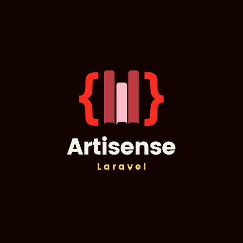

<div align="center" style="padding-top: 2rem;">
    
</div>

[](https://packagist.org/packages/artisense/artisense)
[](https://github.com/artisense/artisense/actions?query=workflow%3Arun-tests+branch%3Amain)
[](https://github.com/artisense/artisense/actions?query=workflow%3A"Fix+PHP+code+style+issues"+branch%3Amain)
[](https://packagist.org/packages/artisense/artisense)

# Artisense 📕

Laravel docs from the comfort of your terminal.

## Table of Contents

- [Getting started](#getting-started)
- [Usage](#usage)
- [Power of Ten Rules](#original-nasa-power-of-ten-rules)
- [Rules]()
    - [1. Avoid complex flow constructs](#rule-1)
    - [2. All loops must have fixed bounds](#rule-2)
    - [3. Avoid heap memory allocation after initialization](#rule-3)
    - [4. Restrict functions to a single printed page](#rule-4)
    - [5. Use a minimum of two runtime assertions per function](#rule-5)
    - [6. Restrict the scope of data to the smallest possible](#rule-6)
    - [7. Check the return value of all non-void functions](#rule-7)
    - [8. Use the preprocessor only for header files and simple macros](#rule-8)
    - [9. Limit pointer use to a single dereference](#rule-9)
    - [10. Compile with all possible warnings active](#rule-10)
- [References](#references)
- [Contributing](#references)

## Getting started

You can install artisense with composer:

```bash
composer require joeymckenzie/artisense
```

You can also publish the config file with:

```bash
php artisan vendor:publish --tag="artisense-config"
```

This will create the following `config/artisense.php` file:

```php
return [

    /*
    |--------------------------------------------------------------------------
    | Artisense Status
    |--------------------------------------------------------------------------
    |
    | This option controls whether Artisense is enabled for your application.
    | When enabled, Artisense features are available throughout your app.
    | Set this value as false disable Artisense functionality entirely.
    |
    */

    'enabled' => true,

    /*
    |--------------------------------------------------------------------------
    | Documentation version
    |--------------------------------------------------------------------------
    |
    | Specifies the version of the documentation to use, with both numbered.
    | versions and master available. By default, the most recent numbered
    | is used if no version is specified while attempting to download.
    |
    */

    'version' => DocumentationVersion::VERSION_12,

    /*
    |--------------------------------------------------------------------------
    | Output Formatter
    |--------------------------------------------------------------------------
    |
    | Specifies the optional formatter that the output should use for markdown.
    | Markdown content will be returned from artisense and can be formatted
    | Using any formatting tools installed wherever artisense is running.
    |
    */

    'formatter' => null,

];
```

## Usage

First, prepare artisense by running the install command:

```bash
$ php artisan artisense:install
```

The install command will do a few things:

1. Download the Laravel markdown documentation files based on the configured version
2. Create a local SQLite database in your project within the storage folder under `storage/artisense`
3. Seed the database with the parsed Laravel documentation

Artisense allows for multiple versions of documentation to coincide with one another. For instance, running the above
command with the default settings will seed documentation within the database for the latest stable version. However,
you may also re-run installation with an updated version value within the `artisense.php`:

```php
return [

    // Other configuration...

    'version' => DocumentationVersion::MASTER,

];
```

You may also install versions by explicitly passing a `--version` flag to the install command:

```php
$ php artisan artisense:install --version "12.x" // (10.x, 11.x, master, etc.)
```

## Usage

```bash
$ php artisan artisense:docs --query "install reverb"
```

## Testing

```bash
composer run test
```

## Changelog

Please see [CHANGELOG](CHANGELOG.md) for more information on what has changed recently.

## Contributing

Please see [CONTRIBUTING](CONTRIBUTING.md) for details.

## Security Vulnerabilities

Please review [our security policy](../../security/policy) on how to report security vulnerabilities.

## Credits

- [Joey McKenzie](https://github.com/joeymckenzie)
- [All Contributors](../../contributors)

## License

The MIT License (MIT). Please see [License File](LICENSE.md) for more information.
